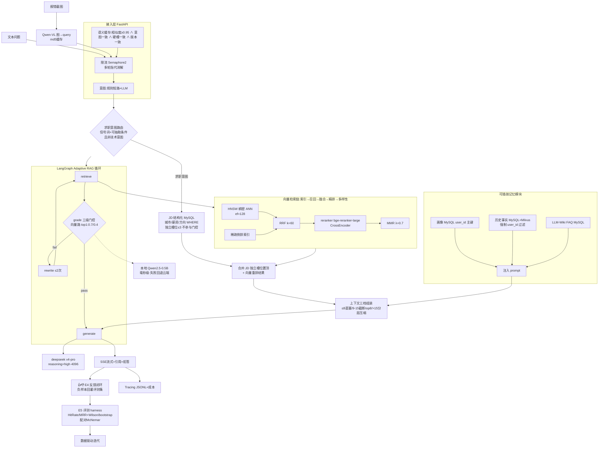

# EdeRAG 架构设计

> 与 README.md 配套;代码与本文档保持一致。

> 对应最新代码状态:Adaptive RAG 循环(检索→自省→改写→生成)+ 求职意图双路召回
> + 可插拔记忆 + 反馈闭环 + 配对统计评测。
> 语料:技术语料 15.7 万子块(黄金父块全保留抽样)+ JD 41,776 子块,共 358,221 行向量。
>
> **整改要点(2026-08-15,依据 GPT-5.6/豆包/Kimi/DeepSeek 四份评审)**:
> ① 召回链路顺序修正为「HNSW/稀疏索引检索 → RRF → reranker → MMR」;
> ② JD 结构化检索仅在求职意图(信号词+可抽取条件,排除技术意图)触发,且**不进入 RRF/重排池**,为独立前置槽位(≤3),门控分数只取向量路重排分;
> ③ 上下文组装补全 8-15 文档分支,预算统一为字符;
> ④ 统计检验:配对场景(McNemar),独立场景(双比例 z),全部附 CI。

## 一、主链路(箭头流程版)

```
                     ┌──────────────┐    ┌─────────────────────┐
                     │   文本问题    │    │ 报错/代码截图(多模态) │
                     └──────┬───────┘    └──────────┬──────────┘
                            │                       │ Qwen-VL 图→结构化query
                            │                       │ (md5 缓存,同图 无额外开销)
                            ▼                       ▼
                ┌─────────────────────────────────────────────┐
                │        ① 接入层 FastAPI(限流 2 并发)          │
                │  多轮指代消解(Redis 历史) → 意图识别            │
                │  → 语义缓存(≥0.95 相似度 ∧ 意图一致 ∧ 求职硬槽  │
                │     一致 ∧ corpus/prompt/model 版本一致)       │
                └──────────────────────┬──────────────────────┘
                                        │ 规则短路(寒暄 无额外开销)+ LLM 分类
                                        ▼
                ┌─────────────────────────────────────────────┐
                │     ② LangGraph Adaptive RAG 循环(核心)      │
                │  retrieve → grade →(fail→)rewrite → generate │
                │  三级门控(向量路 top1 重排分):                │
                │    ≥0.7 直过 / ≤0.4 直拒 / 混沌区 0.5B 仲裁    │
                │  改写上限 2 次;异常降级单次检索兜底            │
                └───────┬──────────────┬───────────────┬───────┘
                        │ 检索         │ 自省/改写      │ 生成
                        ▼              ▼               ▼
        ┌───────────────────────┐  ┌──────────┐  ┌───────────────┐
        │ ③ 双路召回(求职意图)   │  │ 本地快模型 │  │ deepseek 云端   │
        │ JD 结构化(MySQL)      │  │Qwen2.5-0.5B│  │ v4-pro         │
        │  城市/薪资/方向 WHERE  │  │ 毫秒级     │  │ reasoning=high │
        │  独立槽位 ≤3,不参与    │  │ 失败回退云端│  │ max_tokens 4096│
        │  门控与 RRF 融合       │  │            │  │ [1][2] 引用溯源 │
        │ ──────────────────── │  └──────────┘  └───────────────┘
        │ 混合向量(Milvus):     │
        │  BGE-M3 稠密(HNSW)    │
        │  + 稀疏(倒排索引)     │
        │  → RRF(k=60) →       │
        │  reranker(bge-       │
        │  reranker-large CE)  │
        │  → MMR(λ=0.7)        │
        │ (HNSW↔IVF_PQ 可切换) │
        └───────────┬───────────┘
                    ▼
        ┌─────────────────────────────────────────┐
        │ ④ 记忆召回注入(可插拔扩展模块)           │
        │ 画像(MySQL,user_id 主键)→ profile_hint │
        │ 历史事实(Milvus 事实层)→ 语义召回注入     │
        │   强制 user_id 过滤,绝不跨用户召回       │
        │ LLM-Wiki FAQ(MySQL)→ 结构化知识补充      │
        └───────────┬─────────────────────────────┘
                    ▼
        ┌─────────────────────────────────────────┐
        │ ⑤ 上下文组装(三档路由,单位=字符)+ 生成    │
        │ ≤8 文档且 ≤12k 字符 → 全文直塞            │
        │ 9-15 文档且 ≤24k 字符 → 保留 top8 截断    │
        │ >15 文档或 >24k 字符 → top2 原文+句子级压缩│
        │ → 生成 → 拒答兜底(向量路 top1 < 0.15)     │
        └───────────┬─────────────────────────────┘
                    ▼
        ┌─────────────────────────────────────────┐
        │ ⑥ 输出与闭环                             │
        │ SSE 流式 + sources 折叠 + 👍👎 反馈       │
        │ → E4 负样本回灌评测集 → E5 统计评测       │
        │ → Tracing(每节点 JSONL + 成本量化)       │
        └─────────────────────────────────────────┘
```

## 二、Mermaid 版(GitHub 可直接渲染)



## 三、数据链路(语料 → 向量库)

```
D:\edrag_corpus_clean(26 仓库清洗语料 + JD 4.6万源文件)
        │ pipeline_1 清洗 → pipeline_2 分块+BGE-M3 编码(产物落盘可重放)
        ▼
D:\edrag_corpus_encoded(预编码向量,数据恢复源)
        │ rebuild_corpus.py(确定性重建:全集 584,834 行 →
        │   按原规模抽样 + 黄金父块 100% 保留 → 358,221 行)
        ▼
Milvus edurag_0421:358,221 行(HNSW 默认,IVF_PQ 切换接口保留)
  ├─ 技术语料 157,000 子块 + 父块(zh53.7%/en31.5%/pt7.3%/ko2.6%/ja0.9%/other4.0%)
  ├─ JD 41,776 子块 + 41,752 父块
  └─ 独立集合 edurag_user_facts(用户事实,物理隔离+user_id 过滤)
```

## 四、评测与工程闭环(整改后口径)

```
评测集分层(来源透明,分指标报告):
  · 合成回归集 453 条(440 LLM 生成 + 12 人工复核 + 1 反馈回灌,全带 source)
    —— 定位:代码改动的 regression 集,不宣称代表真实线上分布
  · dev 308 / blind 145(seed=42;blind 含全部 13 条人工+反馈来源,
    冻结不参与调参;定位为 synthetic held-out)
  · 真实口语风格子集 56 条(human_written:技术 46 + 求职 10,
    口语化/碎片化问法,独立报告)——分布外探测
        │
        ▼
eval_harness(hit-rate / agent-hit-rate / compare / RAGAS)
  · 单组比例:Wilson 95%CI(HitRate)+ bootstrap 2000 次 CI(MRR,seed=42)
  · 配对对比(同一批 query):McNemar 精确检验 + 配对 bootstrap CI
    —— 双比例 z 检验仅用于独立样本,并显式标注 test 类型
  · 与历史记录 diff
        │
        ▼
消融决策(S4/S5 配对 A/B 实测;S6 为工程踩坑记录;S2 为实测后主动弃用)
        │
        ▼
CI(pytest + 检索快检)+ E4 线上反馈回灌 → 迭代
```

## 五、可靠性机制

1. **数据可重放**:清洗/分块/编码产物全部落盘(`D:\edrag_corpus_encoded`),
   `rebuild_corpus.py` 确定性重建(同源同规模,评测数字可复现);
2. **破坏性操作显式化**:初始化路径禁止自动 drop,删库只能显式
   `clear()` / `rebuild_corpus.py --rebuild`;
3. **索引实验可回滚**:`rebuild_dense_index` 仅动索引层、数据不动,失败即回滚 HNSW;
4. **容器持久化验证**:etcd 显式 `--data-dir /etcd/data`(元数据真正落卷),
   卷统一挂载 `D:\EdeRAG_volumes`,迁移前 `du` 验证挂载点;
5. **资源预算**:入库分批+周期 flush;重任务串行化(避免 desktop heap 耗尽);
6. **缓存失效**:语义缓存 key 带 corpus_version(重建自增→全量失效),
   连续 5 个 👎 软删缓存;
7. **降级链**:FAQ 快筛 → Milvus RAG(含拒答/缓存)→ 纯 LLM 兜底,
   任何一层挂了仍有答案。

## 六、运行前提与常用命令

- 依赖安装:`pip install -r requirements.txt`,装完 `pip check`;
- 服务依赖:MySQL / Redis / Milvus(Docker:`docker compose up -d`);
- 初始化 FAQ 库:`python -m 1MySQL_qa.mysql_qa_main init-db`;
- 构建知识库:`python MAIN.py rebuild`(首次或语料更新后);
- 命令行问答:`python MAIN.py query "问题"`;
- 启动 Web:`python run.py`(http://127.0.0.1:8000);
- 检索评测:`python -m 2Milvus_RAG_Qa.RAG评测.eval_harness hit-rate`(另有 agent-hit-rate / compare);
- 生成侧评测:`python -m 2Milvus_RAG_Qa.RAG评测.ragas_evaluate`;
- 测试:`pytest -q`;一键 CI:`python ci_check.py`。

配置与密钥:`static/config.ini` 提供默认连接参数,敏感项(LLM / 多模态 / 上传管理
的 API Key,如 EDU_LLM_API_KEY、EDU_DASHSCOPE_API_KEY、EDU_APP_UPLOAD_API_KEY)
全部通过环境变量或 `.env` 注入,参照 `.env.example`(其中的 X-API-Key 为占位示例,
真实密钥不入库)。
